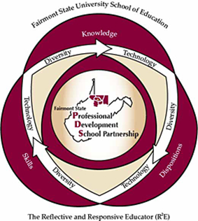

# Fairmont State School of Education Conceptual Framework

The mission of the Fairmont State University School of Education is to prepare reflective and responsive educators who possess the knowledge, skills, and dispositions to help all students learn. The Fairmont State University School of Education mission is integrated across the curriculum, field experiences, clinical practice, and assessments of candidates. The conceptual framework provides the structure and guiding principles that are necessary to accomplish this mission. The five West Virginia Professional Teaching Standards and their respective functions undergird the knowledge, skills, and dispositions that candidates must possess in order to facilitate learning for all students. Diversity and technology are included in the conceptual framework representing themes that are integrated throughout the unit's programs. Demonstrated competencies in the standards/functions empower candidates to function as reflective and responsive educators. The conceptual framework is based on research about effective teaching and learning best practices that apply to teacher candidates at the initial level as well as accomplished teachers at the advanced level. The conceptual framework and the West Virginia Professional Teaching Standards also are central guiding elements of the Fairmont State University Professional Development School Partnership that provides a critical structure and context for teacher education and educator professional development.

